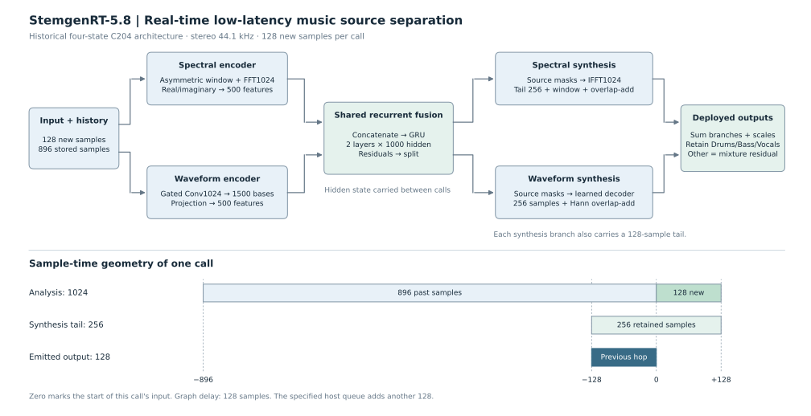

# StemgenRT-5.8: A Hybrid Asymmetric Recurrent Network for Real-Time Low-Latency Music Source Separation

**Working manuscript · 11 September 2026 · Version 0.1**

**Authors and affiliations:** to be supplied.

**Historical scope · Naming revision: 20 September 2026.** This 11 September v0.1 draft describes the four-state C204 predecessor. The current maintained model has eight states; the architecture and results reported here do not evaluate that model.

**StemgenRT-5.8** names the latency variant: 256 samples of graph-plus-host algorithmic delay at 44.1 kHz, or approximately 5.805 ms, rounded to 5.8 ms. It excludes audio-device latency and does not measure execution time. A separate revision identifies models that share this latency budget. This draft describes the historical HS-TasNet-derived architecture pinned in reference [7]. The current eight-state implementation is `StemgenRT58` in the `stemgenrt` package; StemgenRT is its host plugin.

## Abstract

Real-time low-latency music source separation must balance reconstruction quality, access to temporal context, and the time available to produce each output block. We describe StemgenRT-5.8, an HS-TasNet-derived separator that combines spectral and learned waveform representations through a shared two-layer gated recurrent unit. A 1,024-sample asymmetric analysis window supplies context to a 256-sample synthesis stage operating at a 128-sample hop. The model carries recurrent and overlap-add states between consecutive blocks and emits four stereo stems with a one-hop output delay. A specified asynchronous plugin path adds one further hop, giving a 256-sample signal-path delay at 44.1 kHz, excluding device latency. We also describe fine-tuning with carried audio context, teacher supervision on ordinary mixtures, and deployed-output supervision on instrumental-only and vocal-only inputs. On a repeatedly used 14-song development panel, the selected checkpoint improves mean scale-dependent SDR from 3.847 to 4.069 dB relative to an earlier checkpoint of the same architecture. Two fixed-selection evaluations on additional passages of those songs corroborate the aggregate improvement. Controlled inputs show lower unwanted output, with remaining source-fidelity failures. These results document an architectural implementation and a development-stage training study; they do not establish unseen-song performance, superiority to published systems, perceptual preference, or zero-miss real-time execution.

## 1. Introduction

Real-time music source separation processes incoming audio while playback continues. Low latency limits the delay added by the separation path. A system can have a short signal delay yet miss its processing deadline. It can also improve an aggregate separation score while removing a quiet instrument or producing an unwanted vocal output during an instrumental passage. Both timing and source-specific behavior therefore matter for live remixing and monitoring.

HS-TasNet provides a starting point by combining spectral and learned waveform branches with recurrent processing [1]. Our implementation retains that hybrid principle but changes the recurrent topology and reconstruction geometry. It uses one shared two-layer GRU, a longer analysis window than synthesis window, and explicit streaming state. Its deployed output retains three estimates and reconstructs the fourth as the mixture residual.

This manuscript makes three contributions at different levels of evidence. First, it specifies the implemented architecture and its sample-time contract. Second, it reports a checkpoint improvement under that fixed architecture, with controlled-input diagnostics and confirmations outside the scored selection passages. Third, it documents conversion and native-streaming checks together with observed timing failures. The architecture changes and the final fine-tuning improvements are separate claims: the latter do not measure the former against the original HS-TasNet.

The research question motivating further evaluation is whether this combination offers a useful quality–latency–compute tradeoff under actual streaming conditions. The present evidence supports writing down the system and its behavior. A broader claim requires matched architectural comparisons and evaluation on untouched songs.

## 2. Relationship to prior work

TasNet learns an analysis and synthesis representation for source separation [2]. Hybrid Demucs combines waveform and spectral processing [3]. HS-TasNet adapts the hybrid approach to low-latency music separation using recurrent branches [1]. We build on Phil Wang's open-source implementation [4]; its configurable GRU option, phase-aware spectral representation, gated waveform encoder, and normalization are part of the implementation lineage.

Asymmetric analysis/synthesis windows are also established. Wang et al. use a longer analysis window with shorter synthesis support for low-latency speech separation [5]. Our window construction explicitly follows that work. Neither asymmetric windows, GRUs, nor combining two signal domains is claimed as a new primitive.

Recent music-separation work also considers alternative causal architectures and inference optimization, including RT-STT [6]. A final comparison should include contemporary systems under compatible data, metric, latency, and hardware conditions. This draft does not claim the first or best low-latency separator.

## 3. Architecture

### 3.1 Signal geometry and state

The input is stereo audio at 44,100 samples/s. Four outputs are ordered Drums, Bass, Vocals, and Other. Define analysis length `K = 1024`, hop `H = 128`, and synthesis length `L = 256`. At each call, the input contributes 128 new samples per channel. These follow 896 stored samples to form the next analysis frame. We use *streaming* for this execution scheme: consecutive audio blocks are processed while model state is carried between calls. Meeting the host's processing deadlines is a separate measured requirement.

The public state consists of four tensors:

| State | Shape for batch size B | Purpose |
| --- | --- | --- |
| Audio history | B × 2 × 896 | Past input for the next analysis frame |
| Recurrent hidden state | 2 × B × 1000 | Shared two-layer GRU memory |
| Spectral numerator tail | B × 4 × 2 × 128 | Pending spectral overlap-add contribution |
| Waveform tail | B × 4 × 2 × 128 | Pending windowed waveform contribution |

State persists across consecutive calls. The exposed recurrent tensor stores the physical GRU hidden state multiplied by `2⁻¹⁸`; the model reverses this fixed scaling before the next GRU call. This is a state-representation convention. A new stream, seek, or discontinuity requires a reset. At a finite stream's end, the caller pads a partial input hop if necessary, submits one additional zero hop, and trims padding and the initial delay. This recovers the real final samples without restarting the recurrent state at excerpt boundaries.



*Figure 1. The two encoders share a recurrent fusion block and return through separate synthesis branches. The timeline distinguishes the longer analysis support from the short emitted block. Skip connections, masks, and state updates are specified in the text; the diagram groups them for readability.*

### 3.2 Hybrid encoding and recurrent fusion

The spectral encoder applies the asymmetric analysis window and a 1,024-point real FFT. It packs real and imaginary components from both channels into 2,052 values and projects them to a 500-dimensional embedding.

The learned waveform encoder applies a stereo convolution with kernel length 1,024 and stride 128. Its 3,000 outputs form 1,500 gated basis activations using `ReLU(a) × sigmoid(b)`. A pointwise projection maps these activations to a second 500-dimensional embedding.

The concatenated embeddings enter a unidirectional, two-layer GRU with input and hidden width 1,000. Its output is added to the concatenated input, split into two 500-dimensional branches, and added to the respective encoder embeddings. Each resulting branch is normalized before mask prediction. There are no separate recurrent stacks before or after fusion within either branch.

The implementation contains **27,823,208 trainable scalar parameters in 21 tensors**, counted directly from the released PyTorch definition. This is a model-size measurement, not an inference-speed benchmark.

### 3.3 Masks and asymmetric synthesis

Each head uses a residual source-softmax transform. For four source logits `z`, the mask is `m = z + 4 softmax(z)`, with softmax taken over sources. The additive logits mean these are not constrained probability masks.

The spectral head predicts weights for each source, channel, frequency bin, and real/imaginary component. Those components are multiplied separately; this is not general complex multiplication of the mixture by a complex-valued mask. An inverse real FFT produces a 1,024-sample frame, of which the final 256 samples are synthesized.

For sample index `n`, the analysis window is

```text
a[n] = sin(π n / 1792)                 for 0 ≤ n < 896
a[n] = cos(π (n − 896) / 256)          for 896 ≤ n < 1024.
```

Let `p[j] = (1 − cos(π j / 128)) / 2` be the periodic Hann window of length 256. On the retained analysis tail, the spectral synthesis window is

```text
b[j] = p[j] / a[768 + j]              for 0 ≤ j < 128
b[j] = a[768 + j]                     for 128 ≤ j < 256.
```

Thus `a[768 + j] b[j] = p[j]` in exact arithmetic. The implementation divides the spectral overlap-add numerator by the corresponding overlap sum. The waveform head masks the 1,500 learned basis activations and decodes each source into a 256-sample stereo frame. Its decoder uses the periodic Hann256 window and 128-sample overlap-add.

This geometry uses past audio for analysis while reconstructing a short tail. It does not require waiting for a fresh, nonoverlapping 1,024-sample block on every call. It also does not make separation an exact reconstruction problem: masks and learned source estimates can introduce distortion even when the analysis/synthesis window pair has the stated product.

### 3.4 Raw estimates and deployed outputs

The spectral and waveform estimates are summed and multiplied by fixed per-source scale buffers, producing four raw estimates. Deployment retains the raw Drums, Bass, and Vocals estimates. Other is computed as

```text
y_other[t] = x_delayed[t] − y_drums[t] − y_bass[t] − y_vocals[t].
```

The four deployed outputs therefore sum to the delayed input within floating-point rounding. Errors in the first three estimates can be transferred into Other. Mixture reconstruction is a consistency property, not evidence that the individual stems are correct.

Training exposes both raw and deployed estimates. Raw supervision trains all four heads, while deployed supervision accounts for the output the listener actually receives.

### 3.5 Architectural distinction and attribution

| Aspect | Original full HS-TasNet in [1] | StemgenRT-5.8 |
| --- | --- | --- |
| Processing domains | Spectral and learned waveform | Spectral and learned waveform |
| Recurrent topology | Branch-local and shared LSTM blocks | Shared two-layer GRU only |
| Analysis / synthesis lengths | 1024 / 1024 samples | 1024 / 256 samples |
| Hop | 512 samples | 128 samples |
| Source output | Combined branch estimates | Combined estimates with residual Other |

These changes define a different computation graph within the HS-TasNet family. The table describes structure, not a controlled performance experiment. It does not attribute every implementation feature to this work: the upstream configurable implementation already supports several choices that differ from the original paper.

## 4. Fine-tuning the fixed architecture

### 4.1 Initialization and data

The selected checkpoint, internally recorded as C204, is the result of a **250-update fine-tuning stage** from a previously trained checkpoint. It was not trained from random initialization in 250 updates. That parent had already undergone transfer and several training stages; the public release supports recovering and fine-tuning the resulting weights. A complete from-scratch reproduction requires a curated account of the earlier student and teacher lineage.

The final stage uses a frozen manifest containing 501 tracks and approximately 36.91 hours of effective aligned audio. Its three configured roots contain 83 MUSDB18-HQ training tracks, 218 MoisesDB tracks, and 200 tracks in a curated RecordPool root, sampled with probabilities 0.50, 0.25, and 0.25 respectively. These are counts in the experiment's manifest, not the nominal sizes of those datasets. Data from additional roots means the result must not be presented as MUSDB-only training.

The manifest records exclusions and duplicate checks. Before external evaluation, the complete student and teacher histories still need a documented overlap audit against the intended test set. Availability of the curated corpus and the requirements to reproduce it also need to be stated in the submission materials.

### 4.2 Audio context and optimizer

Each crop contains 176,128 samples: 88,064 samples of history followed by 88,064 scored samples, about two seconds each. The prefix advances all four states without retaining its gradient graph. The suffix uses the resulting detached state, includes the flush needed for alignment, and is compared against ground truth at the same physical sample times.

An effective batch of 16 is formed from four microbatches of four. Losses are divided by the accumulation count, gradients are clipped once at norm 5, and Adam updates once per effective batch. The final stage uses fresh Adam state, 25 warmup updates, a peak learning rate of `3 × 10⁻⁵`, and a cosine decay toward `3 × 10⁻⁶` over a 250-update schedule.

CUDA training applies BF16 to learned dense kernels while retaining FP32 parameters, FFT operations, synthesis, losses, and externally carried state. Evaluation uses FP32. The final-stage configuration records model RNG seed 20260921 and crop-selection seed 60. One seed does not measure training variability.

### 4.3 Controlled source views and objective

Ordinary augmentation uses either an unchanged mixture, a subset of its stems, or vocals shifted between examples. The subset and vocal-derangement branches have probabilities 0.25 and 0.125 before controlled-view replacement. A four-example cycle then assigns one instrumental-only input, one vocal-only input, and two ordinary augmented inputs. The controlled examples use the original aligned stems with excluded targets set to zero.

Let `Lw` be waveform L1 averaged over channels and time and weighted across Drums, Bass, Vocals, and Other by `(2,1,1,1)/5`. The final cleanup objective is

```text
L = Lw(raw, truth)
    + λp Lprojection
    + 0.5 Lteacher,ordinary
    + 0.5 Ltruth,controlled.
```

The teacher and controlled terms compare deployed outputs. Teacher targets come from the fixed earlier C91 separator and participate only for ordinary views. Ground-truth deployed supervision participates only for controlled views. Both terms are averaged over the complete microbatch, including the excluded rows as zeros. This denominator is part of the recipe.

The projection penalty measures squared cosine similarity between estimated vocals and active accompaniment references on deranged-vocal examples, using the final second of the scored suffix. Its weight is the smaller of 0.01 and a detached cap that limits the contribution to approximately 0.5% of unweighted raw L1. Desired vocals and interfering references must pass the configured activity threshold. This penalty does not supervise every possible direction of leakage; the controlled views explicitly address vocal output without vocals and vocal contamination of instrumental outputs.

The selected parent-transfer experiment changes the starting checkpoint while keeping the cleanup recipe. It does **not** isolate the contribution of each loss from that stronger parent. Such an attribution requires additional matched controls.

## 5. Evaluation protocol

### 5.1 Development and confirmation passages

The primary panel contains 14 development songs. Each contributes passages at 30–45 and 75–90 seconds. A physical-time streaming evaluator processes the mixture continuously through the required prefixes and gaps and compares aligned outputs without per-excerpt state resets or normalization.

Two confirmations use other passages of those same songs: 105–120 and 135–150 seconds for the first, then 45–60 and 120–135 seconds for the additional confirmation. The checkpoint was fixed before each confirmation's scoring; the additional passages were prospectively reserved before the later follow-up results. The corresponding first-use record binds the final choice before inference.

These passages are outside the scored selection windows but are not independent songs. Earlier streams also processed mixture prefixes and gaps as context. We therefore describe the results as within-song corroboration after fixed selection, not held-out-test performance.

### 5.2 Metrics and aggregation

The primary score is scale-dependent waveform SDR, computed in nonoverlapping one-second windows. For reference `s` and estimate `y`, it uses

```text
SDR = clip(10 log10((Σ s² + ε) / (Σ (y − s)² + ε)), −60, 60),
ε = 10⁻¹².
```

The sums include both stereo channels. Reference windows at or below −50 dBFS are excluded from the active-source SDR. Scores are averaged in dB over eligible windows within each track/source, then across tracks for each source, and finally across the four source means. Low-band SDR uses an ideal real-FFT mask over each excerpt, retaining bins from 20 Hz inclusive to 250 Hz exclusive, followed by the same window scoring and activity rule on filtered references.

The reported interference SIR is a separate instantaneous-projection diagnostic. For estimated source `i` and reference `j`, it fits one scalar `g_ij = <y_i,s_j> / (||s_j||² + ε)` jointly across channels and time. Desired projected energy is compared with summed off-target projected energies. Estimates below −100 dBFS, or with negligible desired projection, receive the score floor for an active target. There is no source permutation, delay search, FIR matching filter, or fitted scale correction to the SDR. Correlated reference sources limit interpretation of the projection diagnostic.

These metric definitions differ from some published BSS Eval and SI-SDR protocols. The values cannot be placed beside published MUSDB scores as directly comparable measurements. The ideal band filter is part of offline scoring, not the causal inference path.

We additionally measure unwanted output level on controlled inputs, output during naturally inactive sources, and fidelity and gain on quiet sources. Lower unwanted output is interpreted together with wanted-source reconstruction.

### 5.3 Uncertainty

Paired intervals use 20,000 bootstrap resamples of whole tracks with seed 91, retaining the source and passage pairing. Reported bounds are the 2.5th and 97.5th percentiles. They describe track sampling within this development panel. They exclude uncertainty from training seeds and do not correct for repeated checkpoint and recipe selection.

## 6. Results

### 6.1 Primary checkpoint comparison

The working baseline and selected checkpoint share the same hop-128 architecture and deployed-output policy. Table 1 reports their primary development comparison.

| Metric, dB | Working baseline | Selected C204 | Difference | Paired track 95% interval |
| --- | ---: | ---: | ---: | --- |
| Full-band SDR | 3.846589 | 4.069079 | +0.222490 | [+0.151870, +0.306618] |
| 20–250 Hz SDR | 2.772156 | 3.055463 | +0.283306 | [+0.203218, +0.375648] |
| Projection SIR | 6.700406 | 7.121449 | +0.421043 | [+0.244364, +0.634695] |

*Table 1. Development comparison at unchanged architecture and scored sample times. These improvements concern training and selection, not an architectural comparison with original HS-TasNet.*

All four source means improve for these three metrics. Full-band SDR improves in 13 of the 14 track means. The selected source scores are 4.141132 dB for Drums, 4.649863 for Bass, 4.918742 for Vocals, and 2.566579 for Other. Relative to the stronger parent immediately before cleanup, full-band SDR improves by 0.043984 dB, with paired interval [+0.007081, +0.093562]. The much larger comparison with the working baseline includes intervening training stages.

### 6.2 Fixed-selection corroboration

| Passage set | Working full SDR | Selected full SDR | Difference | Paired track 95% interval |
| --- | ---: | ---: | ---: | --- |
| 105–120 / 135–150 s | 3.889436 | 4.127920 | +0.238484 | [+0.153539, +0.335283] |
| 45–60 / 120–135 s | 3.999413 | 4.238471 | +0.239059 | [+0.156880, +0.349275] |

*Table 2. Additional passages from the same 14 development songs, scored after fixing the checkpoint. Absolute scores differ with the material; 4.238471 dB does not replace the primary score in Table 1.*

The first confirmation improves low-band SDR by 0.299322 dB and SIR by 0.463180 dB. The additional confirmation improves them by 0.272786 and 0.412583 dB. All four source means improve for all three metrics in both confirmations. In the additional set, all 14 track means improve in full and low-band SDR; 12 improve in SIR. These results support the direction of the checkpoint improvement across passages while retaining the dependence on familiar songs.

### 6.3 Leakage and remaining failures

On controlled instrumental inputs, mean unwanted Vocal output falls 3.632562 dB relative to the working baseline. On vocal-only inputs, unwanted Other output falls 2.848040 dB. Wanted vocal-only full-band SDR rises 3.260426 dB; wanted instrumental Drums, Bass, and Other SDR rises 0.208911, 0.208617, and 0.650880 dB respectively. These diagnostics concern controlled mixtures and native levels, not subjective ratings.

The improvement is uneven. On the primary panel, James May vocals lose 0.258744 dB full SDR and Young Griffo Other loses 0.278267 dB low-band SDR. Other output increases 1.610331 dB in its single naturally inactive primary window. Skelpolu vocal-only reconstruction remains poor, with 0.557641 dB SDR and signed reference-projection gain 0.080160. Quiet-vocal SDR improves but remains −18.884190 dB; the single quiet Other window regresses by 1.607919 dB.

The additional confirmation also retains losses, including 0.204915 dB full SDR for Meaxic vocals and 0.340253 dB low SDR for Young Griffo Other. It has no eligible naturally inactive Other cells, so it cannot resolve the primary Other-inactivity regression. These cases limit any claim of uniformly clean separation.

### 6.4 What the existing controls establish

Earlier teacher comparisons matched the starting student and 4,000 augmented examples over 1,000 updates. The two teacher choices differ by only 0.017965 dB in student full SDR, with an interval spanning zero. A separate 500-update comparison matched 8,000 examples and teacher targets while changing student history from 88,064 to 352,256 samples; the aggregate full-SDR difference was small and uncertain.

The final cleanup transfer also matched its 4,000 examples, teacher targets, and final RNG state against the earlier cleanup run from the working parent. This supports interpreting that comparison as a change of trained initialization under one recipe. It does not establish that longer history or a particular teacher is generally superior, or that any single cleanup term causes the complete improvement in Table 1.

## 7. Real-time implementation and timing verification

### 7.1 Delay and processing deadlines

The model's first output after reset corresponds to pre-input history; call `N` emits the previous input hop. This gives a 128-sample graph alignment delay. In the specified StemgenRT path, a 128-sample host preparation and queue add one further hop.

| Quantity | Samples at 44.1 kHz | Time | Scope |
| --- | ---: | ---: | --- |
| Graph output alignment delay | 128 | 2.902 ms | Neural graph and reconstruction |
| Additional scheduling queue | 128 | 2.902 ms | Specified prepared 128-sample host path |
| Combined signal-path delay | 256 | 5.805 ms | Graph plus that host queue |

*Table 3. Signal delay for a specified configuration. These values are not per-hop execution times, worst-case response times, or complete audio-interface round-trip latency.*

A processing overrun can still occur within this delay budget. Qualification must therefore report both the sample-time contract and the distribution of completion times under a paced workload.

### 7.2 Model conversion and stream correctness

The public release supplies a trainable PyTorch model, a pinned self-contained FP32 ONNX model, weight recovery, checkpoint resume support, and export verification [7]. Tests compare all four deployed outputs with independent CPU FP32 PyTorch references around hop boundaries, including input lengths 1, 127, 128, 129, 255, 256, 257, and 16,521 samples. They cover reset replay, the initial delay, final-sample recovery, and mixture reconstruction.

The recorded native continuous-music comparison recovers all 3,307,648 real input frames with one graph flush and one queue drain. Eight partial-end cases and reset replay pass. The selected and working graphs have identical structure after excluding initializer values and metadata, so the final checkpoint change adds no inference operations.

These are correctness and conversion checks. Passing them does not establish audio quality on a new corpus or deadline compliance.

### 7.3 Timing evidence and limits

The developer supplied Apple M4 results reporting 162 correctness passes and one skip. Two production-paced runs recorded 2 misses in 10,000 callbacks and 16 misses in 30,000 callbacks. Raw M4 measurement artifacts were not available for independent inspection when this draft was prepared. A retained Linux paced test also failed its deadline criterion.

Consequently, this manuscript makes no strict zero-miss real-time claim. A submission needs repeatable hardware and host specifications, warmup and load conditions, execution-time distributions, overrun handling, and sufficiently long paced runs. Practical use of a build and formal deadline qualification are different observations.

## 8. Discussion and evaluation still required

StemgenRT-5.8 separates three design choices that are often conflated: how much past signal informs an estimate, how much audio is synthesized at each step, and when a host can deliver that audio. A shared recurrent core carries longer temporal information, while the asymmetric reconstruction limits the output block geometry. The implemented combination provides a concrete architecture to investigate; its individual advantages remain hypotheses until controlled comparisons are complete.

The training results also motivate evaluating absence and preservation together. Residual Other guarantees mixture consistency but can conceal vocal underestimation by routing it into Other. Suppressing an output during controlled silence can improve leakage measurements while damaging quiet desired sources. The retained failures show why aggregate SDR alone is insufficient for this application.

Before a research submission, the following experiments are priorities:

1. **Untouched-song evaluation.** Freeze the model and protocol, document overlap checks covering student and teacher training, and report full-song results on a test set not used for selection. Include a standard benchmark metric alongside the existing physical-level diagnostics.
2. **Architectural comparisons.** Match data, optimization budget, and initialization strategy when comparing branch-local recurrence with shared-only recurrence, symmetric with asymmetric synthesis, and alternative hop sizes. Report model size and measured computation with each quality result.
3. **Training comparisons.** From the same stronger parent, compare ordinary supervision, teacher supervision, controlled views, and deployed-output loss. Repeat selected comparisons across seeds. Separate a component's effect from the benefit of additional updates.
4. **Perceptual evaluation.** Conduct blinded listening with references and appropriate anchors, covering wanted-source fidelity, interference, transient behavior, and quiet or inactive sources. No completed human preference study is reported here.
5. **Paced deployment evaluation.** Measure latency and deadline distributions on named hardware and host configurations. Report missed deadlines and fallback behavior along with average throughput.

Existing results should remain development evidence after those experiments. They should not be relabeled as held-out measurements or used to tune against the final test set.

## 9. Conclusion

StemgenRT-5.8 is a distinct HS-TasNet-derived computation graph designed for real-time low-latency music source separation. It combines shared recurrent fusion, asymmetric analysis/synthesis, and explicit state carried between audio blocks. Its released implementation provides a specified short-delay signal path and verified conversion and stream-boundary behavior. Fine-tuning the fixed architecture improves development metrics and controlled-input leakage, with corroboration on additional passages of familiar songs. Unseen-song quality, component-level attribution, listening preference, and reliable deadline behavior remain the next requirements for a stronger research claim.

## Reproducibility and provenance

The manuscript describes public source revision `041388e72d7e36395e9d55f529f047d6429460c8`, subsequently merged into the release. The selected state fingerprint is `c204b0fcb9627ca7fecd287db42fb869a1ae6783a1bc24cf2d8864c3b4a565fb`; the deployed ONNX SHA-256 is `b8574ac2e67bcd1df533e3fc7464c0659d4bfa6744cfbb4389c0967271594fe3`.

The historical training interface at the pinned source revision reproduces the architecture described here and supports new fine-tuning. Importing release weights alone does not recover the original historical optimizer state or constitute a from-scratch reproduction. The underlying evidence ledger, extracted results, and evaluation artifacts remain unpublished. This manuscript reports their findings but does not provide an independently inspectable supplementary dataset.

## References

1. Satvik Venkatesh, Arthur Benilov, Philip Coleman, and Frederic Roskam. [Real-time Low-latency Music Source Separation using Hybrid Spectrogram-TasNet](https://arxiv.org/abs/2402.17701). ICASSP, 2024.
2. Yi Luo and Nima Mesgarani. [TasNet: Time-domain Audio Separation Network for Real-time, Single-channel Speech Separation](https://arxiv.org/abs/1711.00541). ICASSP, 2018.
3. Alexandre Défossez. [Hybrid Spectrogram and Waveform Source Separation](https://arxiv.org/abs/2111.03600). ISMIR Music Demixing Workshop, 2021.
4. Phil Wang (lucidrains). [HS-TasNet implementation](https://github.com/lucidrains/HS-TasNet/tree/5bd950260d26efb2797c7c2d8b101c77f69abda7). Source revision `5bd9502`.
5. Shanshan Wang, Gaurav Naithani, Archontis Politis, and Tuomas Virtanen. [Deep Neural Network Based Low-latency Speech Separation with Asymmetric Analysis-Synthesis Window Pair](https://arxiv.org/abs/2106.11794). EUSIPCO, 2021.
6. Junyu Wu, Jie Liu, Tianrui Pan, Jie Tang, and Gangshan Wu. [Towards Practical Real-Time Low-Latency Music Source Separation](https://arxiv.org/abs/2511.13146). arXiv preprint, 2025.
7. Sweet Spot Sound System. [HS-TasNet streaming model and training release](https://github.com/sweetspotsoundsystem/HS-TasNet/tree/041388e72d7e36395e9d55f529f047d6429460c8) and [StemgenRT](https://github.com/sweetspotsoundsystem/stemgen-rt). Software, 2026.

## Author decisions for the next revision

Confirm the authors, affiliations, and contributor roles. Choose a target venue and its formatting requirements. Curate the full training lineage and data description, including primary dataset citations, corpus availability, and the material needed for independent reproduction. Complete the experiments in Section 8 before replacing the draft's limited claims with broader ones.
